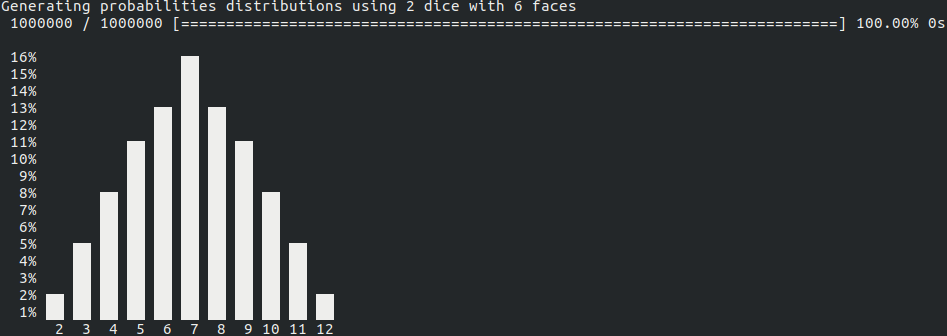
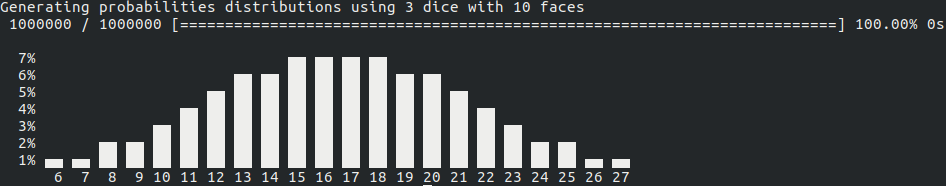
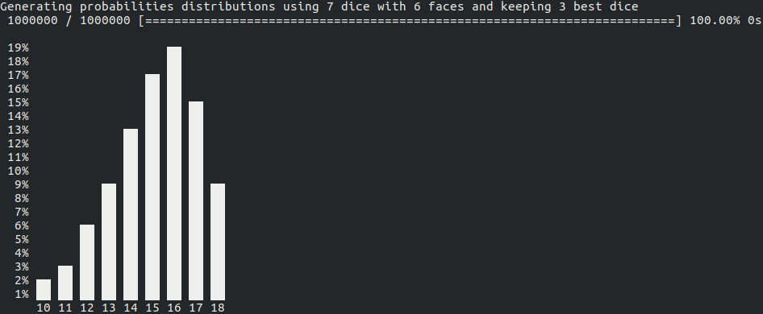
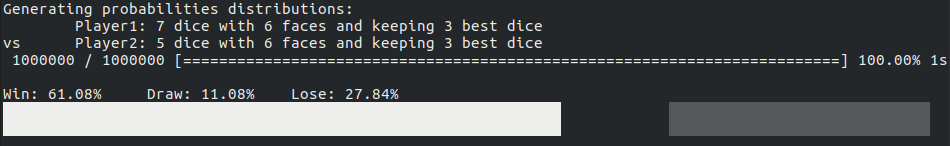
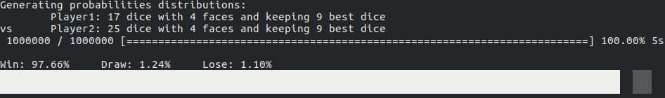

# Dice Probability Distribution Software
This software generate probability distribution for a given dice throw.  


## Download
| System        | 32-bit        | 64-bit |
| ------------- |---------------| ------|
| Windows       | [dice-stats-windows-386.tar.gz](raw/master/misc/app/dice-stats-windows-386.tar.gz) |  |
| Linux         | centered      |   $12 |
| OSX           | are neat      |    $1 |

**Windows:** [dice-stats-win.tar.gz](https://github.com/KmeCnin/dice-stats/raw/master/app/dice-stats-win.tar.gz)  
**Linux:** [dice-stats-linux.tar.gz](https://github.com/KmeCnin/dice-stats/raw/master/app/dice-stats-linux.tar.gz)  
**OSX:** [dice-stats-osx.tar.gz](https://github.com/KmeCnin/dice-stats/raw/master/app/dice-stats-osx.tar.gz)  
## Throw query format
`{n}d{m}(k{p})` where:
- `n`: number of dice to throw
- `m`: number of faces of each dice
- `p`: number of best dice results to keep  

**Examples:** `2d6`, `3d10`, `7d6k3`.

## Prompt use
```shell
> Throw query:
```
Requires a string that must follow the `Throw query format`.
```shell
> Versus throw query (leave empty to ignore)
```
Can be a string that must follow the `Throw query format` or be empty in order to skip.  
If provided, it will generate win probabilities for first throw quiery against this one.

## Command use
The only **argument** required is a string query following the `Throw query format`. 

### Command Option
#### Iterations
- **Syntax:** `-i`
- **Type:** `int`
- **Default:** `1000000`
- **Example:** `> ./dice-stats -i=10000 2d6`

Number of iterations to use in order to define probabilities accuracy.
#### Versus
- **Syntax:** `-vs`
- **Type:** `string` using throw query format
- **Default:** *none*
- **Example:** `> ./dice-stats -vs=3d6 2d6`

Use another dice throw and compare chances to win against this one.
## Example
Generate probability distribution for throwing 2 dice with 6 faces:
```shell
> ./dice-stats 2d6
```

Generate probability distribution for throwing 3 dice with 10 faces:
```shell
> ./dice-stats 3d10
```

Generate probability distribution for throwing 7 dice with 6 faces and keeping the 3 best results:
```shell
> ./dice-stats 7d6k3
```

Generate probability distribution of winning throwing 7 dice with 6 faces and keeping the 3 best results against 5 dice with 6 faces and keeping the 3 best:
```shell
> ./dice-stats -vs=5d6k3 7d6k3
```

Generate probability distribution of winning throwing 17 dice with 4 faces and keeping the 9 best results against 25 dice with 4 faces and keeping the 6 best:
```shell
> ./dice-stats -vs=25d4k6 17d4k9
```

